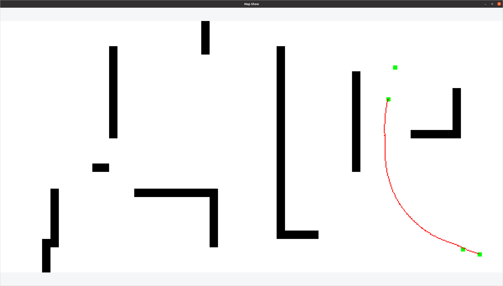
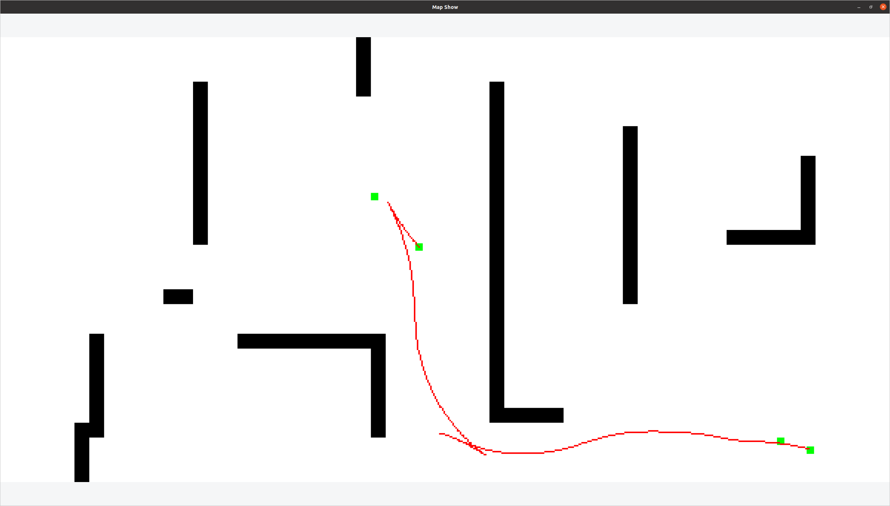

# Hybrid A Star 的实现

参考仓库 : [zm0612/Hybrid_A_Star](https://github.com/zm0612/Hybrid_A_Star)

相较与参考仓库，将库抽离了ROS，并在app/node中实现了一个基本的规划Demo。更改碰撞计算为多圆模型。并且对Cost的计算也进行了一定的优化。并且取消了对Eigen库的依赖。

用户可继承HybridAStar类，并且修改其中的虚函数以实现自己的Hybrid A Star 子类。

## 构建方式

- 仓库显示使用的是OpenCV 4 实现的。仅用于显示。

``` shell
mkdir build && cd build
cmake ..
make
```

- Run A Demo

``` shell
./build/node
```

用四次点击描述规划。第一次点击是选择起点位置，第二次是起点方向。第三次是终点位置，第四次是终点方向。

效果如下：



